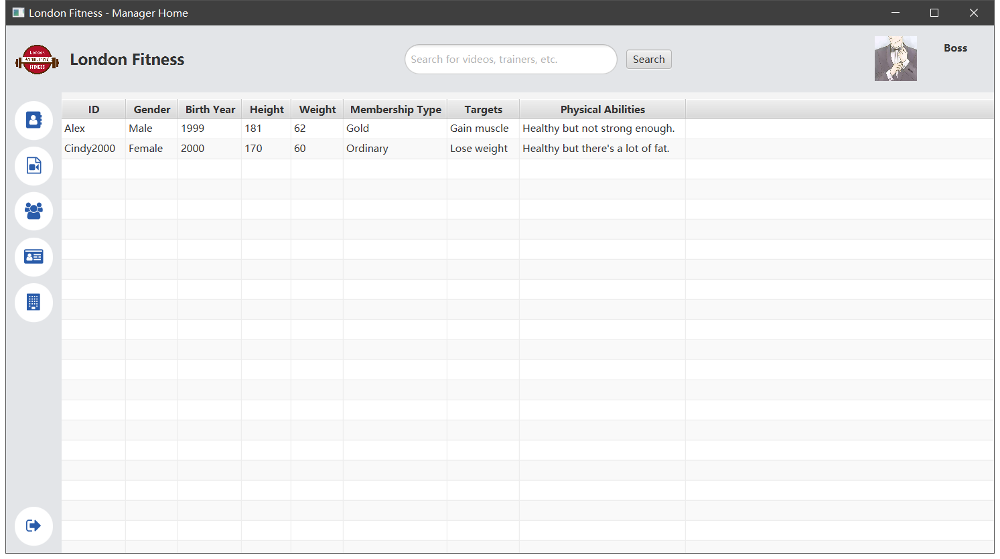
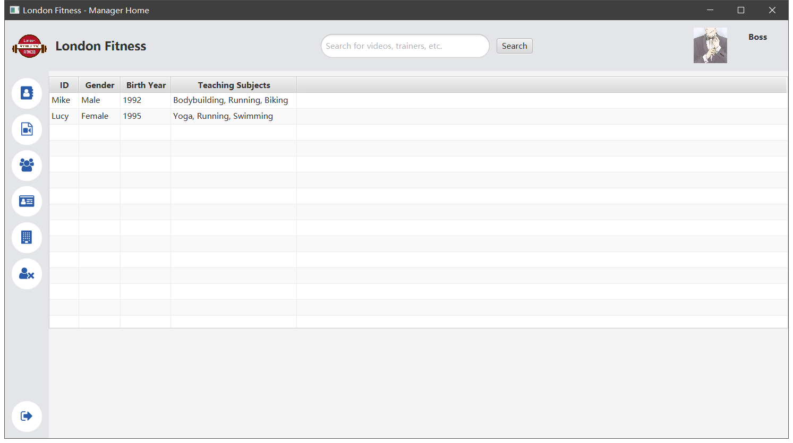
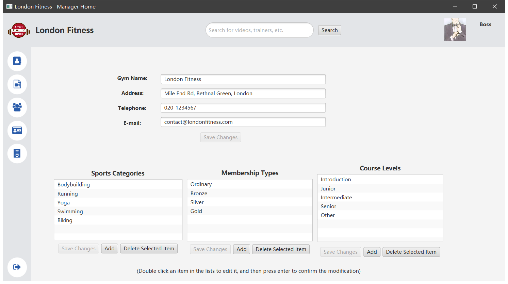
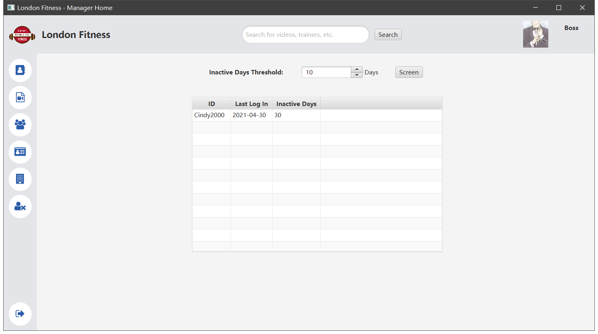
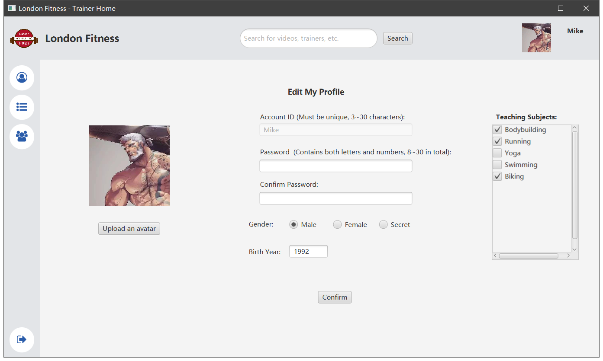
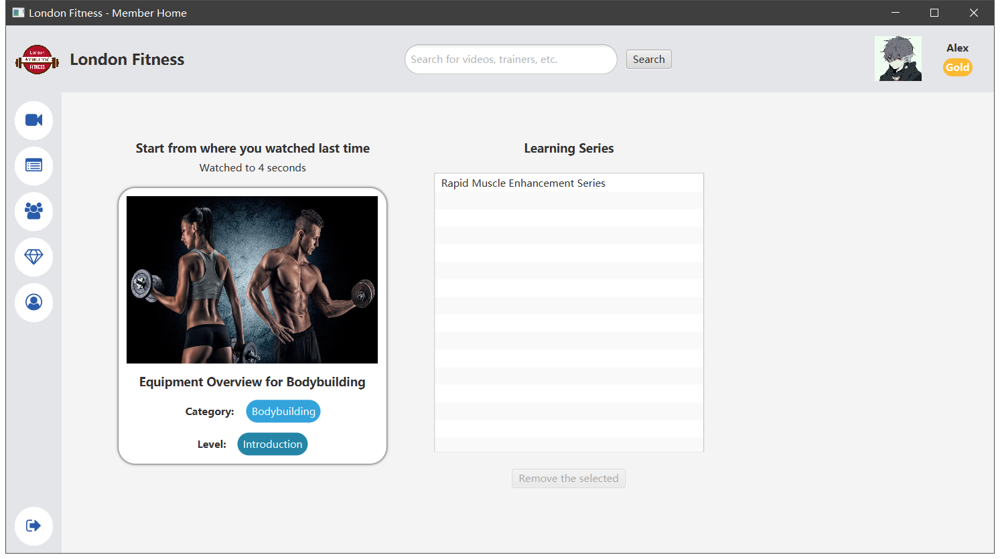
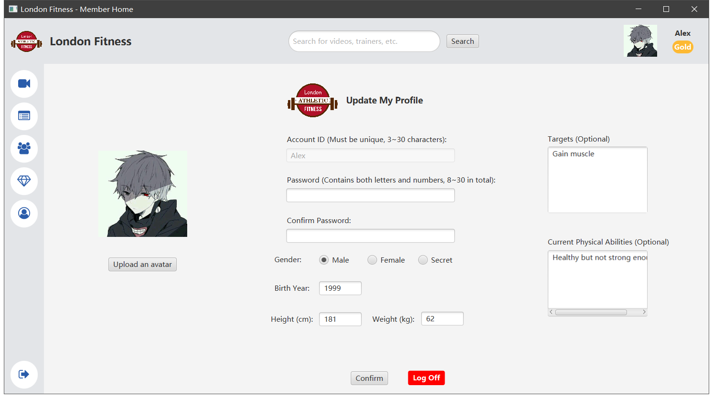

# digital-gym

This is a Java client program for a hypothetical gym called *London Fitness* to provide online services.

**Current Version: 2.0**

The following technologies are mainly used:

- **GUI**: JavaFX
- **Data Storage**: JSON (FastJson)
- **Project Management Tool**: Maven
- **Unit Test Framework**: JUnit 5
- **Version Control System**: Git & Github

## Accounts for Test

Since the password have been encrypted in JSON files, you cannot read them as plain text. But you can use any of the following accounts to experience this program：

**Manager:**

- Account ID: Boss
- Password: boss12345

**Trainers:**

- Account ID: Mike
- Password: mike12345

- Account ID: Lucy
- Password: lucy12345

**Members:**

- Account ID: Alex
- Password: alex12345

- Account ID: Cindy2000
- Password: cindy200012345

## Screenshots

### Sign In

### Sign Up

------

### For Managers

#### 1. Register a New Trainer

#### 2. Video Management

#### 3. Member List

#### 4. Member List

#### 5. Gym Management

#### 6. Inactive Members

------

### For Trainers

#### 1. Profile Editing

#### 2. Schedule

#### 3. Students

------

### For Members 

#### 1. Sports Videos

#### 2. Video Player

#### 3. Video Player (Full Screen)

.png)

#### 4. Learning Records

#### 5. Trainers

#### 6. Book a Live Session

#### 7. Upgrade Membership Type

#### 8. Edit Profile

